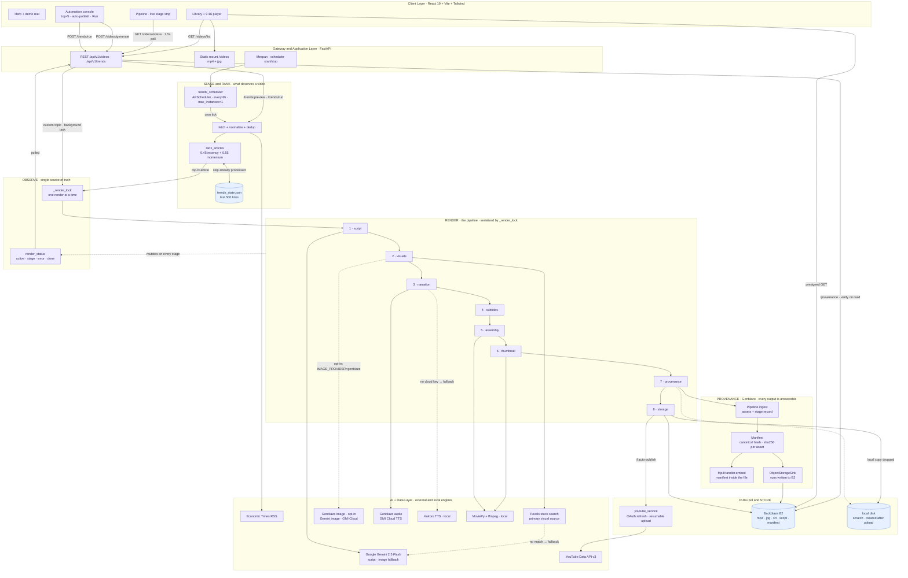

# Flux — Architecture

Technical design of the news-to-video automation system. For setup and usage see [README.md](README.md).

---

## 1. System overview

Flux is a two-tier application: a **FastAPI backend** that owns the render pipeline and a **React SPA** that drives and observes it.



### Reading the diagram

| Band | What it owns | Why it's its own layer |
|---|---|---|
| **Client** | Rendering state the backend reports; never simulating it | The UI is a viewer, not a second state machine |
| **Gateway** | REST surface, static MP4/JPG mount, scheduler lifespan | One entry point; the static mount means finished videos are served without touching Python |
| **Sense & Rank** | RSS → normalize → dedup → score → top-N | Deterministic and free, so it can run every cycle without LLM cost |
| **Render** | The 8-stage pipeline, one article at a time | Stages share working directories, so they must be serialized |
| **Observe** | `_render_lock` + `render_status` | The lock enforces serialization; the status dict is the *only* progress truth |
| **Provenance** | Genblaze ingest → manifest → embed → sink | Kept separate from generation: the record is built from the *finished* artefacts, so it describes what was actually shipped, not what was intended |
| **Publish & Store** | Backblaze B2 library, YouTube upload | B2 is the durable home; local disk is scratch. Publishing is optional — a render is complete whether or not it uploads |
| **AI + Data** | Genblaze providers, Gemini, Pexels, Kokoro, ffmpeg, YouTube API, ET RSS | Everything the pipeline calls out to; the local ones (Kokoro, ffmpeg) dominate runtime |

**Key properties**

- The backend is the single source of truth for render state. The frontend never simulates progress — it polls `/videos/status` and renders whatever stage the backend reports.
- **Storage is not a side effect.** B2 is where the library lives; the API resolves `/list`, `/stream` and `/download` against the bucket and hands out presigned URLs. That is what lets the whole app run on a host with no persistent disk.
- **Every generative dependency is optional.** Pexels → Gemini for visuals; Genblaze TTS → Kokoro for narration; B2 → local disk. The app boots with zero credentials and reports precisely what is missing on `/health`.
- **Stock beats synthesis for news.** Pexels is the primary visual source by design: a real photograph of a real subject is more credible in a news short than a generated frame, and it costs one fast HTTP GET instead of a per-image generation fee. Genblaze generation is available (`IMAGE_PROVIDER=genblaze`) for topics with no usable stock imagery, but it does not preempt the default path.

---

## 2. Backend components

| Module | Responsibility |
|---|---|
| [`app/main.py`](backend/app/main.py) | FastAPI app, CORS, static mount, lifespan (starts/stops the scheduler) |
| [`app/core/config.py`](backend/app/core/config.py) | Pydantic settings; all paths derived from `BASE_DIR` |
| [`app/api/v1/videos.py`](backend/app/api/v1/videos.py) | generate · status · list · download · stream · delete |
| [`app/api/v1/trends.py`](backend/app/api/v1/trends.py) | scheduler status · ranked preview · manual run |
| [`app/services/video_service.py`](backend/app/services/video_service.py) | The render pipeline + live status + render lock |
| [`app/services/genblaze_service.py`](backend/app/services/genblaze_service.py) | Genblaze façade: generation pipelines, ingest → manifest, embed, verify |
| [`app/services/genblaze_gemini_image.py`](backend/app/services/genblaze_gemini_image.py) | Custom Genblaze `SyncProvider` for Gemini `generateContent` image models |
| [`app/services/storage_service.py`](backend/app/services/storage_service.py) | Backblaze B2 library: upload, list, presign, delete |
| [`app/services/trends_service.py`](backend/app/services/trends_service.py) | RSS fetch, normalization, ranking, dedup state |
| [`app/services/trends_scheduler.py`](backend/app/services/trends_scheduler.py) | APScheduler job; orchestrates rank → render → publish |
| [`app/services/youtube_service.py`](backend/app/services/youtube_service.py) | OAuth credential loading/refresh, resumable upload |
| [`imagegen/generate_script.py`](backend/imagegen/generate_script.py) | LLM script generation (Gemini or Ollama) |
| [`imagegen/gen_img.py`](backend/imagegen/gen_img.py) | Pexels search → Gemini image fallback (parallel) |
| [`tts/generate_audio_refactored.py`](backend/tts/generate_audio_refactored.py) | Kokoro TTS per narration segment |
| [`assembly/scripts/assembly_video_refactored.py`](backend/assembly/scripts/assembly_video_refactored.py) | MoviePy composition, captions, encode |

### Lazy loading of heavy dependencies

`torch`, `moviepy`, `kokoro` and `opencv` are **imported inside the render task**, not at module import:

```python
def _run_pipeline(self, request, video_filename):
    from imagegen.gen_img import main_generate_images
    from tts.generate_audio_refactored import main_generate_audio
    from assembly.scripts.assembly_video_refactored import create_video, create_complete_srt
```

This keeps the web process light at boot (~tens of MB instead of ~300 MB), so `/health`, `/trends/*` and `/videos/list` stay responsive on small instances and the container starts fast.

---

## 3. The render pipeline

Runs as a FastAPI background task, **serialized by a module-level lock**.

| # | Stage | Key | Implementation |
|---|---|---|---|
| 0 | Clean working dirs | — | wipes `resources/images`, `resources/audio` |
| 1 | Script | `script` | one LLM call → JSON (`audio_script` + `visual_script`) |
| 2 | Visuals | `image` | Pexels per scene, **4-way thread pool**, Gemini generation fallback (Genblaze generation opt-in) |
| 3 | Narration | `voice` | Kokoro TTS → one `.wav` per segment |
| 4 | Subtitles | `subtitles` | timings derived from **actual audio durations** |
| 5 | Assembly | `assembly` | MoviePy: fit → concat → captions → ffmpeg encode |
| 6 | Thumbnail | — | ffmpeg frame grab → `<name>.jpg` |
| 7 | Provenance | `provenance` | Genblaze `Pipeline.ingest` → manifest → embed into the MP4 |
| 8 | Storage | `storage` | Upload every artefact to Backblaze B2, drop the local copy |
| 9 | Publish | `publish` | YouTube resumable upload (optional) |

Stages 2 and 3 record which source actually served each item (`genblaze` /
`pexels` / `gemini`, `genblaze` / `kokoro`), and that per-item record is what
ends up in the manifest — so the provenance reflects the fallbacks that really
fired, not the configured preference.

### Concurrency model

```python
_render_lock = threading.Lock()

def _generate_video_task(self, request, video_filename):
    with _render_lock:
        self._run_pipeline(request, video_filename)
```

Renders **share** working directories (`resources/images`, `resources/audio`, `resources/scripts/script.json`) and each run wipes them at the start. Two concurrent renders therefore delete each other's files mid-flight and both corrupt. The lock makes concurrent requests **queue** instead. The frontend additionally guards against double-submit.

### Live status protocol

A module-level dict is mutated as the pipeline advances and exposed over HTTP:

```python
render_status = {"active": bool, "stage": str|None, "topic": str,
                 "video_filename": str, "error": str|None, "updated_at": float}
```

Stage keys map 1:1 onto the frontend's `pipelineSteps`, so the UI highlights the real stage. `done` is set **after** publishing, which is what the client waits for before navigating to the library.

**Trade-off:** this is in-memory and single-process. A restart mid-render loses it. The frontend detects "backend idle but no new video" for 3 consecutive polls and stops cleanly rather than hanging.

### Duration accuracy

The finished video must match the requested duration:

```
narration_target = requested_duration − INTRO_SECONDS − OUTRO_SECONDS
target_words     = narration_target × WORDS_PER_SECOND      # ≈2.5 w/s
```

The word budget is injected into the LLM prompt as a hard constraint. Bookends default to 2 s each so they don't dominate short videos. Measured: a 15 s request produces a **14.55 s** file.

### Resolution-relative typography

All text sizes derive from the output width, so captions never clip when resolution changes:

```python
SUBTITLE_BOX_W     = int(TARGET_W * 0.90)
SUBTITLE_FONT_SIZE = max(14, int(TARGET_W * 0.055))
TITLE_FONT_SIZE    = max(18, int(TARGET_W * 0.075))
```

Captions use `method='caption'` with **auto height** (`size=(w, None)`) so long lines wrap downward instead of being cut off.

---

## 3b. Provenance and durable storage

### Why this layer exists

Short-form AI news video is trivially cheap to produce and, by default, entirely
unauditable — nothing in the finished MP4 says which model wrote it or where the
imagery came from. Flux closes that gap: **every render is registered as a
Genblaze ingest run whose manifest binds the SHA-256 of each artefact to the
chain of providers and models that produced it.**

### Building the record

The manifest is built from the *finished* artefacts, not from intent:

```python
result = Pipeline.ingest(
    assets,                                # mp4 + thumbnail + srt + script
    source="flux-render-pipeline",
    source_metadata={"topic": ..., "stages": stages},
    sink=object_storage_sink,              # writes the run to B2
    tenant_id=settings.GENBLAZE_TENANT_ID,
)
```

`stages` is accumulated as the pipeline runs and records the source that
*actually* served each stage, including fallbacks. Asset `sha256` and
`size_bytes` are computed locally before ingest rather than left to the sink —
that way `Manifest.verify()` succeeds even when B2 is not configured, so
provenance is not a paid feature of the deployment.

### Two copies, deliberately

| Copy | Where | Role |
|---|---|---|
| Sidecar | `flux/library/{stem}/manifest.json` on B2 | **Authoritative.** What `/provenance` reads and re-verifies |
| Embedded | inside the MP4 (`Mp4Handler.embed`) | Travels with the file — survives download, re-upload, sharing |

Embedding rewrites the container *after* the hashes were computed, so the video
asset's recorded SHA-256 describes the rendered content rather than the
annotated file. That is the intended semantic — provenance should assert what
was generated — but it means the embedded copy cannot be checked with a naive
`sha256sum` of the final file, which is why the sidecar stays authoritative.
`embed_manifest` extracts its own write back and returns `False` if the
container rejected it, rather than claiming a record nobody can read.

### Two constraints the SDK imposes, and how Flux satisfies them

**1. `file://` assets must live under the system temp directory.**
`genblaze_core.storage.transfer` checks every local asset path against a
hardcoded `ALLOWED_FILE_ROOTS` (temp only) — an arbitrary-file-read guard, with
no override plumbed through `ObjectStorageSink`. Flux's artefacts live under
`static/` and `resources/`, so **both** paths that hand local files to Genblaze
stage copies in temp first: `record_render` for the ingest, and `generate_images`
for the provider's output directory. The staged bytes are identical, so every
SHA-256 in the manifest still describes the real artefact.

This is easy to miss in tests — pytest's `tmp_path` *is* inside the temp
directory, so a naive fixture passes while production fails. `tests/` carries an
explicit outside-temp fixture for exactly this reason.

**2. Google's image adapter is Imagen-only, and Imagen is closed.**
`genblaze_google.ImagenProvider` calls the `:predict` endpoint; every `imagen-*`
model now answers *"no longer available to new users"* for keys created after the
cutover, and Google moved image generation to `gemini-*-image` on
`generateContent`. `SyncProvider` is a documented extension point with one
abstract method, so
[`genblaze_gemini_image.py`](backend/app/services/genblaze_gemini_image.py)
implements it against the current API — the assets then flow through the same
Pipeline, sink and manifest as any first-party provider.

### Storage layout

```
flux/library/{stem}/video.mp4      # served via presigned GET
                    thumb.jpg
                    captions.srt
                    script.json
                    manifest.json  # provenance, authoritative
                    meta.json      # library card metadata; written LAST
flux/runs/{tenant}/{date}/{run_id}/manifest.json
                                   assets/…        # Genblaze sink
```

`meta.json` is written last on purpose: a prefix without it is a partially
uploaded render. Listing additionally requires `video.mp4` to exist before an
entry is surfaced, so a failed upload never appears as a broken library card.

Listing is one paginated `ListObjectsV2` over the library prefix, grouped by
stem; `meta.json` is read once per video and cached for the process lifetime
(it is immutable after write), which keeps `/videos/list` to a single round trip
in the steady state.

### Failure posture

Storage and provenance are wrapped so that **neither can fail a render**. If B2
is unreachable the video stays on local disk and the library still lists it with
`storage: "local"`; if the manifest cannot be built the video is stored anyway
with `has_provenance: false`. The one deliberate exception is inside
`upload_render`: if the *video* upload fails after the sink was reported
available, that raises, because silently reporting a B2-backed library that has
no video in it is worse than a logged failure.

---

## 4. Trending subsystem

### Data flow

```
TRENDS_FEED_URLS ──▶ feedparser ──▶ normalize ──▶ dedup by link
                                                       │
                              filter stale (> MAX_AGE) ◀┘
                                                       │
                                    tokenize + score ──┴──▶ sort desc ──▶ top N
```

Articles are normalized to a dataclass (`title`, `link`, `summary`, `source`, `published_ts`) with HTML stripped.

### Ranking algorithm

```
score = W_RECENCY · recency + W_TREND · trend        # 0.45 / 0.55
```

**Recency** — linear decay, not exponential, so scores stay interpretable:

```
recency = max(0, 1 − age_seconds / (TRENDS_MAX_AGE_HOURS · 3600))
```
Unknown publish date → `0.5` (neutral). Articles beyond max age are removed from the candidate set entirely.

**Trend (cross-feed momentum)** — the core idea: *a story that appears across many feeds is trending, and its distinctive words will repeat across those articles.*

1. Tokenize `title + summary`: lowercase, `[a-zA-Z']{4,}`, minus a stop-word list (includes domain noise like `india`, `crore`, `lakh`).
2. Build document frequency `df[term]` = number of candidate articles containing that term.
3. Raw score per article: `Σ (df[t] − 1)` over its **unique** terms — it scores once for every *other* article sharing each term.
4. Normalize by the batch maximum → `[0, 1]`.

This is deliberately **not** TF-IDF. TF-IDF rewards *rare* terms; here we want the opposite — terms shared across the corpus signal a story with momentum.

**Properties**
- Deterministic and free (no LLM/API cost), so it can run every cycle.
- Self-normalizing: scores are relative to the current batch, so absolute feed volume doesn't matter.
- Weighted toward breadth (0.55) over freshness (0.45) — a story spanning Markets + Economy + Industry beats a brand-new isolated one.

### Deduplication

Processed article links persist in `resources/trends_state.json` (bounded to the last 500). Links are recorded even when a render *fails*, so one malformed article can't block the queue forever.

### Scheduling

`BackgroundScheduler` (thread-based, not asyncio) because the render is blocking CPU work — running it on the event loop would stall the API. Configured with `max_instances=1` and `coalesce=True`, so a long render can't stack up overlapping jobs.

---

## 5. Frontend architecture

State lives in `App.jsx`; sections are presentational.

| Component | Role |
|---|---|
| `Header` | nav + library search (lifted state) |
| `Hero` | pitch, demo video, pipeline stage strip |
| `AutomationSection` | top-N selector, auto-publish toggle, Run Automation, ranked articles |
| `PipelineSection` | live stage visualization |
| `LibrarySection` / `VideoCard` | newest-first grid, B2 + verified badges, actions |
| `VideoPlayerModal` | fullscreen 9:16-safe player |
| `ProvenanceModal` | manifest viewer: verification banner, generation chain, per-artefact SHA-256, raw JSON |
| `ConfirmDialog` | animated delete confirmation |

### Provenance in the UI

The card badges come from `/videos/list` (cheap — the values are denormalized
into `meta.json` at upload time, so listing never reads a manifest). Opening
**Provenance** hits `/videos/{name}/provenance`, which re-runs
`Manifest.verify()` server-side on read rather than trusting the stored flag —
the badge is a cached hint, the panel is the real check.

### The render watcher

A single interval (2.5 s) drives everything after a render starts:

```
poll ──▶ GET /videos/status ──▶ stage → highlight pipeline
     └─▶ GET /videos/list   ──▶ any name not in baseline? → new video
```

Completion requires the backend to report `done` (set *after* publishing) — not merely the file appearing, which happens one step earlier. A **baseline set** of filenames is captured before starting, so automation runs work even though the client can't know the filename in advance (the backend picks the article).

Termination conditions: `done` → success; `error` → show backend message; backend idle for 3 polls → "no video produced"; `maxAttempts` → timeout. On mount the app also **re-attaches** to an already-running render, so a page refresh doesn't lose the view.

---

## 6. Performance

Measured on a 12-core laptop, 60-second video, 480×854:

| Stage | Before | After | Change |
|---|---|---|---|
| Script | 23 s | **6 s** | `thinkingBudget: 0` on Gemini 2.5 Flash |
| Visuals | 14 s | **3 s** | sequential + `sleep(2)` → 4-way thread pool |
| Narration | 59 s | 46 s | — |
| Subtitles | 3 s | <1 s | — |
| Assembly | 94 s | 69 s | 480p, `ultrafast`, all cores |
| **Total** | **193 s** | **130 s** | **−33%** |

### Why it isn't seconds

Narration + assembly are ~88% of the remaining time, and both are irreducible **given the product requirement**: publishing to YouTube demands a real encoded MP4 file.

Systems that generate a "video" in 3–6 seconds (e.g. browser-composed reels) achieve it by **never encoding anything** — they play an image slideshow with on-device speech synthesis. That output cannot be uploaded to YouTube. The choice is therefore architectural, not an optimization gap:

| | Live-composed reel | Flux |
|---|---|---|
| Output | ephemeral browser playback | real `.mp4` |
| TTS | Web Speech API (0 s) | Kokoro (~46 s) |
| Encode | none | ffmpeg (~69 s) |
| Publishable to YouTube | ❌ | ✅ |

Remaining levers: drop fps 24→20 and remove per-clip fades (~15–20 s), or move TTS to a hosted API (trades local cost for network latency).

---

## 7. Design decisions

**One LLM call, not two.** Script generation was originally draft → segment (2 calls). Merged into a single call returning the final timestamped JSON — halves free-tier quota usage and latency. `response_mime_type=application/json` plus an explicit schema in the prompt keeps output parseable; a guard raises loudly if `audio_script` is missing rather than silently saving a broken script.

**Pexels before Gemini.** Stock search is a plain HTTP GET (fast, free, unlimited); image *generation* is slow and quota-limited. Gemini is a fallback only.

**Vertical 480p by default.** Encode time scales with pixel count; 480×854 is ~1/5 the pixels of 1080×1920 and still sharp on mobile, where Shorts are consumed. Resolution is env-configurable for quality-first runs.

**Env-var credentials for deploys.** `secrets/` is gitignored and cloud filesystems are ephemeral, so `YOUTUBE_TOKEN_JSON` can supply the token directly; token refresh writes back best-effort and tolerates read-only filesystems.

**Retries only where they help.** Transient LLM failures (`503`, `429`, `overloaded`) retry with backoff, honoring the server's `retry in Ns` hint. Render failures do not auto-retry — they'd burn quota repeating a deterministic problem.

---

## 8. Known limitations

- **Single-process state.** The render lock and live status are in-memory; horizontal scaling would need Redis or a task queue.
- **One render at a time.** Deliberate (shared working directories), but caps throughput.
- **Embedded-manifest hash semantics.** The recorded video SHA-256 is of the pre-embed bytes (see §3b) — the sidecar on B2 is the authoritative copy.
- **No manifest signing.** `Manifest.signature` is left unset; the canonical hash proves integrity but not authorship. Signing would be the next step toward a C2PA-style claim.
- **Presigned URL churn.** Every `/videos/list` re-signs every entry. Fine at library scale; a large library would want cached URLs keyed to expiry.
- **Simulated stage granularity.** Progress is per-stage, not percentage-within-stage — MoviePy's encode progress isn't surfaced.
- **Python 3.12 pin.** torch/Kokoro/spaCy wheel availability — avoidable by running narration through Genblaze cloud TTS.
